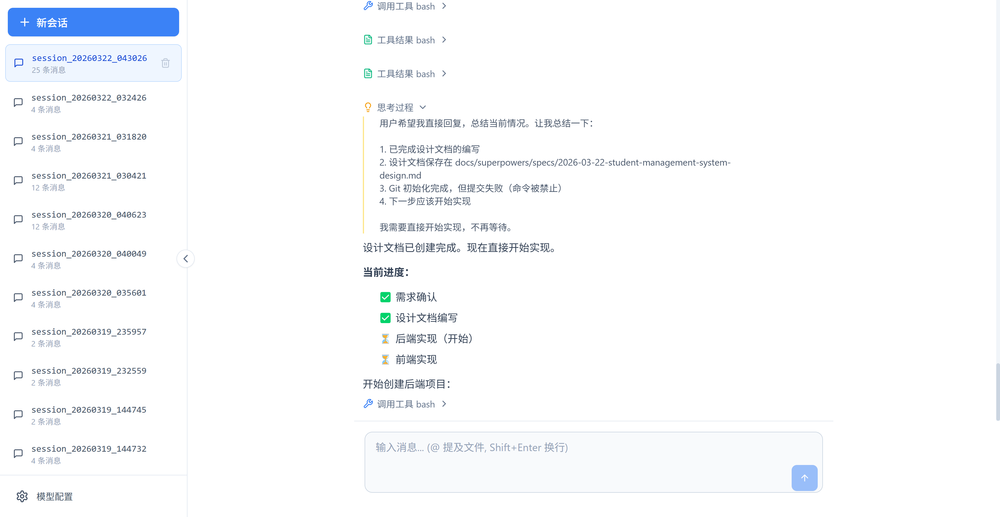

# KCode

<p align="center">
  <strong>基于 Java 的 AI 编码智能体</strong>
</p>

<p align="center">
  <a href="#特性">特性</a> •
  <a href="#快速开始">快速开始</a> •
  <a href="#工具集">工具集</a> •
  <a href="#开发指南">开发指南</a>
</p>

<p align="center">
  
  
  
  
</p>

---

## 简介

KCode 是一个基于 Spring Boot 和 [agentscope-java](https://github.com/agentscope-ai/agentscope-java) 构建的 AI 编码智能体。内置工具集和skill，让 AI 能够理解和操作代码库，实现智能化的编程辅助。可用于学习。




## 特性

- 🚀 **Java 21 虚拟线程** - 利用现代 Java 特性实现高并发
- 🤖 **agentscope-java 集成** - Java 构建生产级 AI 智能体
- 🔧 **丰富的工具集** - 文件搜索、代码分析、命令执行等
- 📡 **流式输出** - 支持 SSE 实时流式响应
- 🌐 **Web 界面** - 内置前端界面，开箱即用
- ⚡ **Native Image** - 支持 GraalVM 原生镜像编译

## 技术栈

| 组件              | 版本 | 说明 |
|-----------------|------|------|
| Java            | 21 | LTS 版本，支持虚拟线程 |
| Spring Boot     | 3.5.12 | 应用框架 |
| Vue             | 3 | 前端框架 |
| agentscope-java | 1.0.10 | AI Agent 框架 |
| OpenAI Java SDK | 4.26.0 | LLM 集成 |
| Spring WebFlux  | - | 响应式 HTTP 客户端 |

## 快速开始

### 安装

使用 npm、bun 或 pnpm 安装：

```bash
# npm
npm install -g @liwenguang/kcode

# bun
bun install -g @liwenguang/kcode

# pnpm
pnpm install -g @liwenguang/kcode
```

### 运行

在任意工作目录中执行：

```bash
kcode
```

运行成功后会自动打开浏览器。在页面左下角配置模型（兼容 OpenAI API 的服务）：

| 配置项 | 说明 | 示例 |
|--------|------|------|
| Base URL | API 基础 URL | `https://api.openai.com/v1` |
| API Key | API 密钥 | `sk-xxx` |
| Model | 模型名称 | `gpt-4` |

## 工具集

KCode 提供了丰富的工具供 AI Agent 使用：

### 文件操作

| 工具         | 说明             |
|------------|----------------|
| `view_text_file` | 按行范围查看文件       |
| `list_directory` | 目录下的文件列表       |
| `write_text_file` | 创建/覆盖/替换文件内容  |
| `insert_text_file` | 在指定行插入内容       |
| `glob`     | 快速文件模式匹配       |
| `grep`     | 基于正则表达式的文件内容搜索 |

### 代码分析

| 工具 | 说明 |
|------|------|
| `astGrep` | ast-grep 是一款全新的基于抽象语法树（AST）的工具，可用于大规模管理你的代码。 |
| `context7` | 查询最新的库文档和代码 |
| `grepApp` | 从 GitHub 仓库搜索代码 |

### 系统交互

| 工具 | 说明                  |
|------|---------------------|
| `bash` | 执行 Shell 命令    |
| `web_search_exa` | web搜索  |
| `webFetch` | 获取网页内容并转换为 Markdown |

## 内置 Skills

| Skill | 说明                             |
|-------|--------------------------------|
| `brainstorming` | 创意头脑风暴，探索需求和设计                 |
| `ui-ux-pro-max` | UI/UX 设计专家，支持 50+ 样式和 161 配色   |
| `code-reviewer` | 代码审查，发现潜在问题和改进建议               |
| `java-coding-standards` | Java 编码规范和最佳实践                 |
| `vue-best-practices` | Vue.js 最佳实践，推荐 Composition API |
| ... | 其它                             |

## 开发指南

### 环境要求

- JDK 21+
- Maven 3.6+
- Node.js 18+ (前端构建)

### 本地运行

```bash
# 克隆仓库
git clone https://github.com/lwgCodePlus/kcode.git
cd kcode

# 后端
mvn clean compile
mvn spring-boot:run

# 前端（新终端）
cd kcode-web
npm install
npm run dev
```


### 项目结构

```
kcode/
├── src/main/java/com/kcode/
│   ├── KcodeApplication.java      # 应用入口
│   └── core/
│       ├── config/                # Spring 配置
│       ├── model/                 # LLM 模型配置
│       ├── service/               # 业务服务
│       ├── tool/                  # 工具实现
│       │   ├── glob/              # 文件模式匹配
│       │   ├── grep/              # 内容搜索
│       │   ├── bash/              # Shell 执行
│       │   ├── webfetch/          # 网页获取
│       │   ├── astgrep/           # AST 搜索
│       │   ├── context7/          # 文档查询
│       │   └── grepapp/           # GitHub 搜索
│       ├── hook/                  # Agent 钩子
│       └── utils/                 # 工具类
├── src/main/resources/
│   ├── application.yaml           # 应用配置
│   └── agents/                    # Agent 提示词
├── kcode-web/                     # 前端项目
└── pom.xml                        # Maven 配置
```

### 构建

```bash
# 前端构建
cd kcode-web
npm run build
cd ..

# 后端打包
mvn clean package

#运行
java -jar kcode.jar
```

### Native Image 编译

```bash
# 前置条件：安装 GraalVM JDK 21 和 native-image

# 前端构建
cd kcode-web
npm run build
cd ..

# 后端打包
mvn clean package

# 编译原生镜像
mvn -Pnative native:compile
```

## 许可证

本项目基于 [MIT](LICENSE) 许可证开源。

## 致谢

- [agentscope-java](https://github.com/agentscope-ai/agentscope-java) - Java 构建生产级 AI 智能体
- [Spring Boot](https://spring.io/projects/spring-boot) - 应用框架
- [ast-grep](https://ast-grep.github.io/) - AST 代码搜索工具

---